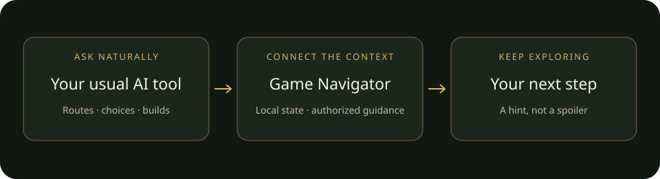

# Game Navigator

### Bring your usual AI tool along for the adventure.

Find your way, plan equipment and skills, weigh a difficult choice, and remember the places worth returning to.
Game Navigator connects a compatible AI tool to supported games on your Windows PC or handheld.

[简体中文](README.zh-CN.md) · [Explore supported games](https://gamenavigator.raycraftlab.com/?utm_source=github&utm_medium=repository&utm_campaign=skill-launch&utm_content=readme-en)

**What you need:** a Skill-capable AI tool on your computer and a supported game on Windows.
Install the handbook and local Navigator, sign in, then connect the gaming device. Choose a game trial only
when you want it: up to three games, five days each. Your AI tool's fees are separate.



## Start here

Copy this message into **Codex, Cursor, or Claude Code** on your computer:

```text
Please install the official Game Navigator Skill and Navigator for me.
Use https://gamenavigator.raycraftlab.com/install.ps1 on Windows,
or https://gamenavigator.raycraftlab.com/install.sh on macOS or Linux.
Inspect the installer before running it, then guide me through sign-in and connecting my gaming PC.
Do not activate a game trial without asking me first.
```

Your AI tool needs access to local installation tools and Skills. If it cannot install software,
[open the product page](https://gamenavigator.raycraftlab.com/?utm_source=github&utm_medium=repository&utm_campaign=skill-launch&utm_content=install-en) for the supported setup path.

Already installing Skills directly from GitHub? The Skill is in [`skills/game-navigator`](skills/game-navigator).
It will help you install the official Navigator on first use; copying a Skill alone does not install the program.

<details>
<summary>Already using the skills CLI?</summary>

Ask your AI tool to review and run:

```sh
npx skills add RayJiang4S/game-navigator-skill --skill game-navigator
```

Choose your AI tool when prompted. This installs the handbook in the current project; add `--global`
if you want it available across projects. Then ask for Game Navigator setup in your AI tool.
The handbook guides official program installation and sign-in. Installation does not activate a trial.
Node.js is needed for this optional CLI route, not for the ordinary setup above.

</details>

Sign in, then tell Navigator whether the game runs on this Windows PC or another Windows device.
For a separate device, it guides you to a clickable installer and a short pairing code. Both devices normally
share a home network. Your AI tool can run on Windows, macOS or supported Linux systems; Play runs on Windows.

## Ask naturally

- “Where should I go next, and what might I have missed?”
- “I found a new weapon. Does it fit my party and skills?”
- “What do these choices mean? Give me a hint without spoiling the story.”
- “Remember this locked chest. Help me revisit it when I have what it needs.”

These are examples, not promises for every game. Available information varies by game and version;
some state comes from the current screen, some from saves, and some from optional reviewed observers.
[Check each game's current capabilities](https://gamenavigator.raycraftlab.com/?utm_source=github&utm_medium=repository&utm_campaign=skill-launch&utm_content=capabilities-en).

### The Witcher 3 Remastered

Plan around the new skill tree and mutations, compare the equipment on screen, and prepare alchemy from
the recipe and ingredient view. Reviewed saves also supply your saved level, available skill points, and
experience. You can ask about a visible screen before saving; off-screen equipment, quest variables, and
unsaved internal changes are not fully readable. No save editor or research toolkit is installed.
The [product page](https://gamenavigator.raycraftlab.com/?lang=en&utm_source=github&utm_medium=repository&utm_campaign=skill-launch&utm_content=witcher-remastered-en)
is the source of current per-game support, including version-specific limits.

## Skill, trial and paid access

**The Skill is open source; the product runtime and commercial service are not.**
An eligible account may choose up to three distinct game packs, each with an independent five-day trial from
activation. Every trial choice requires your confirmation; uninstalling does not reset it.
Afterward, use a subscription for the supported catalog or purchase permanent access to an individual pack,
where purchasing is available. Existing entitlements work regardless of the installation entrance.
The Server—not this repository—determines current eligibility, availability and access.
Your own AI tool/account is required; its fees are separate.

## Privacy and safety

Game saves, frames and local journey memory are not uploaded to the Game Navigator Server.
Your chosen AI tool may process information you give it under its own policies.
Optional community improvement sharing is off until you agree. Navigator does not play for you, edit memory,
or bypass anti-cheat. Optional observers require a separate explanation and your agreement.

<details>
<summary>What gets installed, and what should I trust?</summary>

The GitHub/directory package contains a readable handbook, not the game-reading program. The official setup
downloads a closed-source local Navigator and a small base catalog; Play is installed on the Windows gaming
device separately. Game packs are installed on demand, not all at once. Optional game observers are separate
choices and may add files to a game's folder; ordinary setup does not authorize them.

The installers check downloaded archives against SHA-256 values from the same HTTPS service. This detects
corruption or a mismatch; it is not an independent publisher signature or proof that software is harmless.
The current release is beta, not a claim of fully signed/notarized stable delivery. Review the installer before
execution, and stop if verification fails or the operating system blocks it—do not disable protection.

Server handles sign-in, device pairing, access and updates. Gameplay evidence stays local to Navigator/Play,
but your chosen AI host may process it under its own policy. A directory listing is not a security endorsement.
See [security and trust boundaries](SECURITY.md) for details and private reporting.

</details>

[Privacy](https://gamenavigator.raycraftlab.com/privacy?lang=en) · [Terms](https://gamenavigator.raycraftlab.com/terms?lang=en)

## Feedback and updates

For help, tell your installed Navigator what went wrong, or use the
[official contact page](https://gamenavigator.raycraftlab.com/contact?lang=en).
GitHub Issues are public: do not attach saves, screenshots with personal information, credentials or payment details.
You can request a game through the product page without installing it.

This repository publishes the user handbook from the maintained product source; it does not contain the
Navigator, Play or Server source code, game datasets, or maintainer tooling.
Official runtime downloads and updates remain on the product's HTTPS service.

## License

The Skill and original documentation in **this repository** are [MIT licensed](LICENSE).
This does not license the proprietary runtime, service, protected game-pack content or third-party game assets,
and does not grant a subscription, trial or trademark rights.
Game Navigator is an independent product, not affiliated with GitHub, Steam or the named AI tools and games.
